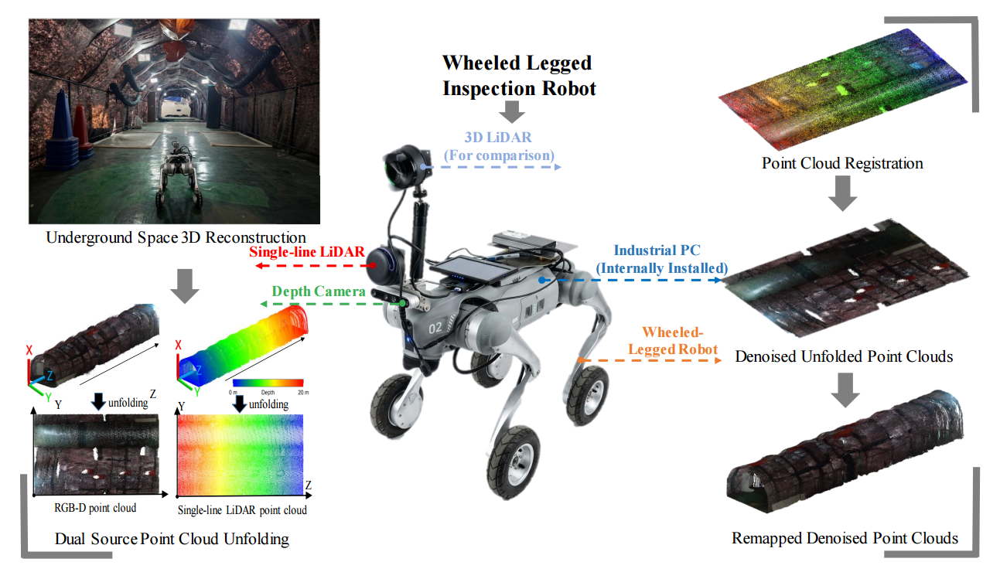

# tunnel_fusion_denoise

ROS package for geometry-constrained fusion denoising of a registered depth-camera point cloud using a registered single-line LiDAR point cloud.


## Features
- Straight centerline estimation from LiDAR points
- Dual-source point cloud unrolling into a common parameter domain
- Cross-modal correspondence construction
- Ensemble residual regression with entropy filtering
- 3D inverse mapping and PCD export of intermediate and final results

## Package structure
```text
ros_pkg_ws/
└── src/
    └── tunnel_fusion_denoise/
        ├── CMakeLists.txt
        ├── package.xml
        ├── README.md
        ├── LICENSE
        ├── requirements.txt
        ├── config/
        │   └── default.yaml
        ├── launch/
        │   └── offline_denoise.launch
        └── scripts/
            └── tunnel_fusion_denoise_node.py
```

## Dependencies
### ROS
- ROS Noetic (recommended)
- catkin
- rospy

### Python
```bash
pip install -r requirements.txt
```

## Build
```bash
cd ros_pkg_ws
catkin_make
source devel/setup.bash
```

## Run
```bash
roslaunch tunnel_fusion_denoise offline_denoise.launch \
  camera_pcd:=/absolute/path/to/CA.pcd \
  lidar_pcd:=/absolute/path/to/LD.pcd \
  output_dir:=/absolute/path/to/results
```

## Output files
The node exports the following files:
- `lidar_centerline.pcd`
- `camera_unrolled.pcd`
- `lidar_unrolled.pcd`
- `camera_matched_input_rgb.pcd`
- `lidar_matched_reference.pcd`
- `camera_denoised_matched_rgb.pcd`
- `camera_denoised_final_rgb.pcd`

## Input requirement
The camera and LiDAR point clouds must already be registered into a common coordinate frame before running this node.

## Notes for open-source release
- Replace all private paths with generic paths.
- Provide at least one small public sample dataset.
- Add a citation section if the code corresponds to a paper.
- Include a version tag when publishing on GitHub or Zenodo.

## Dataset

The point cloud datasets associated with this work include:

real tunnel point clouds
low-light scenes
strong-light scenes
dust-fog interference scenes

The dataset contains both before-processing and after-processing point clouds, including intermediate results and final denoised outputs.

More complete datasets can be found in the files submitted to IEEE DataPort. The corresponding link is provided in the paper.

Dataset DOI: 
    10.21227/7ba7-tv69 
Dataset URL: (https://ieee-dataport.org/documents/geometry-constrained-camera-and-lidar-fusion-underground-confined-spaces-1)

## Notes
The input point clouds must already be aligned in a common coordinate system.
This repository currently provides offline file-based processing, not real-time ROS topic subscription.
The current implementation uses a straight LiDAR centerline model.
For robust matching, reasonable registration quality and overlap between the two modalities are recommended.

## Contact

Hongtao Yang
School of Mechatronics Engineering
Anhui University of Science and Technology
Huainan 232001, China
Email: lloid@163.com
